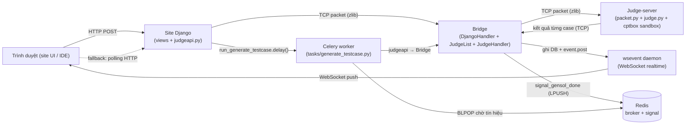
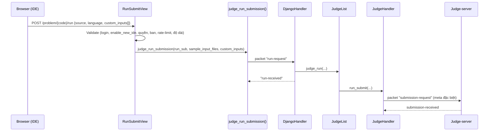
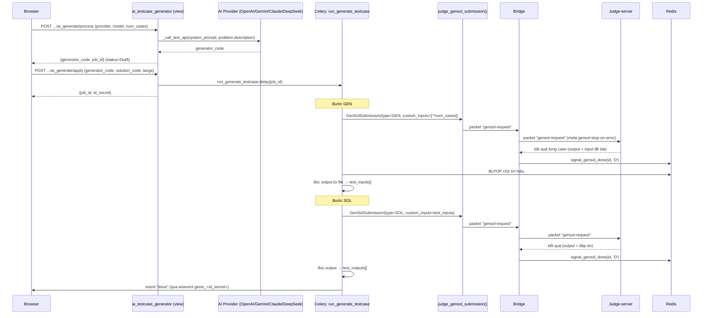

# Tài liệu luồng SUBMIT / RUN / GENSOL (AI Generate Testcase)

> Tài liệu mô tả chi tiết 3 luồng chấm bài của hệ thống: **Submit** (nộp bài chính thức),
> **Run** (chạy thử trên IDE mới), và **GenSol** (sinh testcase bằng AI).
> Phạm vi code: `aloj-docker/dmoj/repo` (site Django + bridge) và `judge-server` (judge daemon).
>
> Nhánh hiện tại: `AI-feature-v1.1` — đang phát triển tính năng **Generate Testcase with AI**.

---

## 0. Bức tranh tổng thể (kiến trúc)

Hệ thống gồm 4 thành phần chạy trong Docker Compose:



**Nguyên tắc chung của giao thức bridge ↔ judge:**

- Mọi packet được serialize bằng `json.dumps`, nén `zlib`, đóng khung bằng 4 byte độ dài (`struct '!I'`).
- Site → Bridge dùng kết nối TCP ngắn (request/reply) qua `judge_request()` trong
  [judgeapi.py](dmoj/repo/judge/judgeapi.py#L27).
- Bridge → Judge dùng kết nối TCP dài (persistent) do judge daemon chủ động mở tới bridge.
- Kết quả chấm đi **ngược** về: Judge → Bridge (`JudgeHandler`) → ghi DB + bắn `event.post` lên wsevent → trình duyệt.

---

## 1. Luồng SUBMIT (nộp bài chính thức)

Đây là luồng gốc của DMOJ, dùng làm nền cho 2 luồng còn lại.

### 1.1. Gửi đi — ai gửi, gửi gì, gửi đến đâu

| Bước | Thành phần | Hành động |
|------|-----------|-----------|
| 1 | Browser | `POST` form nộp bài (source + language) đến view nộp bài |
| 2 | Site `judge_submission()` | Reset trạng thái về `QU`, xoá `SubmissionTestCase` cũ, gửi packet `submission-request` tới bridge |
| 3 | Bridge `DjangoHandler.on_submission()` | Đẩy vào `JudgeList.judge()`, trả về `submission-received` |
| 4 | Bridge `JudgeHandler.submit()` | Gửi `submission-request` cho judge daemon |
| 5 | Judge `packet._receive_packet()` | Nhận, gọi `judge.begin_grading()` với `Submission(...)` |

Packet `submission-request` (Site → Bridge), xem
[judge_submission()](dmoj/repo/judge/judgeapi.py#L55):

```jsonc
{
  "name": "submission-request",
  "submission-id": 123,
  "problem-id": "aplusb",
  "language": "CPP17",
  "source": "<mã nguồn>",
  "judge-id": null,
  "banned-judges": ["judge2"],
  "priority": 0            // DEFAULT / CONTEST / REJUDGE / BATCH_REJUDGE
}
```

### 1.2. Nhận về — ai nhận, nhận gì

Judge daemon bắn các packet ngược về bridge. Bridge xử lý trong
[judge_handler.py](dmoj/repo/judge/bridge/judge_handler.py):

| Packet từ judge | Handler bridge | Tác động |
|-----------------|----------------|----------|
| `submission-processing` | `on_submission_processing` | `status='P'`, gán `judged_on` |
| `grading-begin` | `on_grading_begin` | `status='G'`, xoá `SubmissionTestCase`, `current_testcase=1` |
| `batch-begin` / `batch-end` | `on_batch_begin/end` | đánh dấu batch |
| `test-case-status` | `on_test_case` | tạo `SubmissionTestCase` cho từng case |
| `grading-end` | `on_grading_end` | tính điểm, `status='D'` |
| `compile-error` | `on_compile_error` | `status='CE'`, lưu log |
| `compile-message` | `on_compile_message` | lưu warning compiler |
| `internal-error` | `on_internal_error` | `status='IE'` |
| `submission-terminated` | `on_submission_terminated` | `status='AB'` |

Mỗi bước bridge `event.post('sub_<id_secret>', {...})` để trình duyệt cập nhật realtime; kết quả **lưu thẳng vào DB** (`Submission` + `SubmissionTestCase`).

---

## 2. Luồng RUN (chạy thử trên IDE mới)

Luồng RUN cho phép người dùng chạy code với **sample testcase** và **custom input** mà **không** lưu vào bảng `Submission` chính. Dùng model riêng `RunSubmission`.

### 2.1. Gửi đi



**View** [RunSubmitView.post()](dmoj/repo/judge/views/run.py#L16) kiểm tra:

- Đăng nhập (`LoginRequiredMixin`).
- `prob.enable_new_ide` phải bật, nếu không → `403`.
- `prob.is_accessible_by(user)`; user không bị `banned_users`.
- **Rate limit**: tổng số `Submission` pending + `RunSubmission` pending `< DMOJ_SUBMISSION_LIMIT`, nếu không → `429`.
- `source` ≤ `DMOJ_IDE_MAX_SOURCE_LENGTH`.
- Ngôn ngữ hợp lệ và nằm trong `allowed_languages`.
- Problem phải có **sample testcase** (`is_sample=True, type='C'`), nếu không → `400`.
- `custom_inputs` là list, tối đa `DMOJ_IDE_MAX_CUSTOM_TESTCASES`, mỗi phần tử ≤ `DMOJ_IDE_MAX_CUSTOM_INPUT_LENGTH`.

Packet `run-request` (Site → Bridge), xem
[judge_run_submission()](dmoj/repo/judge/judgeapi.py#L115):

```jsonc
{
  "name": "run-request",
  "submission-id": 45,
  "problem-id": "aplusb",
  "language": "CPP17",
  "source": "<mã nguồn>",
  "judge-id": null,
  "banned-judges": [],
  "priority": 0,
  "sample-input-files": ["aplusb/1.in", ...],   // tên file input của sample
  "custom-inputs": ["3 5\n", "10 20\n", ...]      // input người dùng tự nhập
}
```

Bridge `JudgeHandler.run_submit()` gửi tới judge bằng packet **`submission-request`** (tái dùng giao thức gốc) với `meta` đặc biệt:

```jsonc
"meta": {
  "sample-testcase-only": true,
  "sample-input-files": [...],
  "custom-inputs": [...],
  "run-output-limit": N      // giới hạn độ dài output bắt về IDE
}
```

### 2.2. Xử lý phía judge-server

Trong [judge.py `_grade_cases()`](../judge-server/dmoj/judge.py#L489):

- Nếu `sample-testcase-only=true`: lọc `flattened_cases`, chỉ giữ case có `config['in']` nằm trong `sample-input-files`.
- Với mỗi `custom-inputs`: tạo **virtual TestCase trong RAM** — `virtual_case._input_data_io = MemoryIO(prefill=..., seal=True)` (không ghi đĩa).
- `run-output-limit > 0` → ghi đè `output_prefix_length` để IDE lấy được output đầy đủ.

### 2.3. Nhận về

Bridge phát hiện `self._is_run = True` và xử lý song song với submit, nhưng:

- **Không** ghi `SubmissionTestCase`; thay vào đó gom kết quả vào list `self._run_test_cases` rồi lưu JSON vào `RunSubmission.case_results`.
- `event.post('run_<id_secret>', {...})` ở từng giai đoạn: `processing`, `grading-begin`, `test-case`, `grading-end`, `compile-error`, `compile-message`, `internal-error`, `aborted`.

Mỗi phần tử trong `case_results`:

```jsonc
{
  "case": 1,
  "status": "AC",            // AC/WA/TLE/MLE/OLE/RTE/IR/SC
  "time": 0.01,
  "memory": 1234,
  "feedback": "...",
  "extended_feedback": "...",
  "output": "<stdout thực tế>"
}
```

### 2.4. Frontend nhận kết quả

- Ưu tiên **wsevent**: `event_dispatcher.on('run_' + runSecret, onRunEvent)`.
- Fallback **polling**: `GET /run/poll/{run_id}` → [RunPollView](dmoj/repo/judge/views/run.py#L112) trả JSON:

| Trường | Ý nghĩa |
|--------|---------|
| `status` | `PENDING` / `done` / `CE` / `IE` |
| `grading_status` | trạng thái nội bộ khi đang chạy (`QU`/`P`/`G`) |
| `result` | kết quả tổng (khi `D`) |
| `time`, `memory` | tài nguyên |
| `passed`, `total_cases` | số case đúng / tổng |
| `testcases[]` | danh sách case như trên |
| `error` | log compile/internal error |

---

## 3. Luồng GENSOL (Generate Testcase with AI) — luồng đang phát triển

Mục tiêu: sinh testcase tự động bằng cách (1) gọi AI sinh **generator code**, (2) chạy generator trên judge để tạo input, (3) chạy **solution code** để tạo output đúng, (4) đóng gói thành zip Themis và import vào problem.

> ⚠️ Trạng thái hiện tại (nhánh `AI-feature-v1.1`): các bước **(4) zip + (6) import đang bị comment** lại
> (chờ thêm popup xác nhận ở frontend). Output cũng **chưa được dọn** (`cleanup_output_files()` bị comment để debug).
> Đây là **MVP đang dev**, không phải bản hoàn chỉnh.

### 3.1. Tổng quan các bước



### 3.2. Giai đoạn AI (gọi LLM)

[ai_testcase_generator.py](dmoj/repo/judge/views/ai_testcase_generator.py):

- `ai_generate_testcase_process` (POST): kiểm tra `is_editable_by(user)`, lấy `AIAPIKey` đã `verified`, giải mã key (Fernet),
  gọi `_call_text_api()` với `GENERATOR_SYSTEM_PROMPT` + mô tả problem. Lưu job `status='DR'` (Draft).
- `ai_generate_testcase_apply` (POST): nhận `generator_code` + `solution_code` + ngôn ngữ → tạo job mới và gọi
  `run_generate_testcase.delay(job.id)` (Celery).
- `ai_generate_testcase_poll` (GET): fallback poll trạng thái job.

**Giới hạn AI:**

- `num_cases`: kẹp trong `[1, MAX_CASES_LIMIT=40]`.
- Timeout gọi API: `_AI_TIMEOUT = 120s`.
- Prompt yêu cầu generator: không đọc stdin, in đúng 1 testcase ra stdout, mỗi case < 1MB, random theo thời gian.
- API key được mã hoá bằng **Fernet** dẫn xuất từ `SECRET_KEY` (`key_ciphertext`), plaintext không lưu lại; chỉ lưu `last4`.

### 3.3. Celery task — orchestrator

[run_generate_testcase()](dmoj/repo/judge/tasks/generate_testcase.py#L153) chạy tuần tự:

| Status job | Giai đoạn |
|------------|-----------|
| `CG` | Compiling Generator |
| `RG` | Running Generator (`num_cases` lần, mỗi lần input rỗng) |
| `CS` | Compiling Solution |
| `RS` | Running Solution (input = output của generator) |
| `ZP` | Zipping *(đang comment)* |
| `IM` | Importing *(đang comment)* |
| `DN` | Done |
| `ER` | Error (kèm `error_stage`, `error_log`) |

Mỗi giai đoạn `event.post('gentc_<id_secret>', {...})` để frontend cập nhật.

**Cơ chế chờ kết quả (điểm mấu chốt):** task dùng **Redis BLPOP** thay vì poll DB —
xem [gensol_signal.py](dmoj/repo/judge/utils/gensol_signal.py):

- Bridge khi chấm xong gọi `signal_gensol_done(id, status)` → `LPUSH gensol_done:<id>`.
- Celery gọi `wait_for_gensol(id, timeout=300)` → `BLPOP` (race-free: nếu signal đã đẩy trước thì trả ngay).
- Hết timeout (`WAIT_TIMEOUT=300s`) → coi như judge treo, fail giai đoạn.

### 3.4. Packet GENSOL

`judge_gensol_submission()` gửi packet `gensol-request` (Site → Bridge):

```jsonc
{
  "name": "gensol-request",
  "submission-id": 78,
  "problem-id": "aplusb",
  "language": "CPP17",
  "source": "<generator hoặc solution code>",
  "type": "GEN",                 // hoặc "SOL"
  "custom-inputs": ["", "", ...] // GEN: rỗng; SOL: các input do generator sinh
}
```

Bridge `gensol_submit()` chuyển thành packet `gensol-request` cho judge với `meta` giống RUN
(`sample-testcase-only=true`, `custom-inputs`, `run-output-limit` = `output_limit` problem hoặc mặc định 2MB).

Judge-server [packet.py](../judge-server/dmoj/packet.py#L280) xử lý `gensol-request`:

- Inject `meta['gensol-stop-on-error'] = True`.
- `short_circuit=False`, `scoring_mode='partial_testcase'`.
- Trong [_grade_cases()](../judge-server/dmoj/judge.py#L616): **dừng ngay** khi gặp `TLE | MLE | OLE | RTE`
  (khác RUN — RUN chạy hết mọi case).

### 3.5. Lưu kết quả GENSOL

Khác RUN/Submit: output **không lưu DB** mà ghi **file** để tránh phình DB.
Xem [_on_gensol_grading_end()](dmoj/repo/judge/bridge/judge_handler.py#L754):

- Output mỗi case ghi vào `/problems/generate_testcase/<gensol_id>/case_<n>.out`
  (thư mục chia sẻ giữa site, celery, bridge).
- DB chỉ lưu metadata nhẹ `case_statuses` (JSON list): `{case, status, time, memory}`.
- `GenSolSubmission.read_case_output(case_num)` để Celery đọc lại output.

Sau khi chấm xong, bridge bắn signal + event ở mọi nhánh kết thúc:

| Tình huống | status signal | event wsevent |
|-----------|---------------|---------------|
| Chấm xong | `D` | `grading-end` |
| Compile error | `CE` | `compile-error` |
| Internal error / ghi file lỗi | `IE` | `internal-error` |
| Abort | `AB` | `aborted` |
| Bridge shutdown khi đang chấm | `IE` | — |

### 3.6. Celery đọc kết quả & kiểm tra lỗi

[_check_gensol_result()](dmoj/repo/judge/tasks/generate_testcase.py#L95):

- `status='CE'` → "Compile error"; `status='IE'` → "Internal error"; khác `'D'` → "Unexpected status".
- Duyệt `case_statuses`: nếu có `TLE/MLE/OLE/RTE/IR/SC` → fail kèm số thứ tự case.
- Nếu số kết quả < số case kỳ vọng → "short-circuited?".
- Đọc output từng file qua `read_case_output`; thiếu file → fail.

---

## 4. Bảng tổng hợp giới hạn & mã trạng thái

### 4.1. Settings giới hạn (settings.py)

| Setting | Giá trị | Áp dụng |
|---------|---------|---------|
| `DMOJ_IDE_MAX_CUSTOM_TESTCASES` | 3–5 | Số custom input tối đa (RUN) |
| `DMOJ_IDE_MAX_CUSTOM_INPUT_LENGTH` | 8192–65536 | Độ dài 1 custom input |
| `DMOJ_IDE_MAX_OUTPUT_DISPLAY_LENGTH` | 8192 | Độ dài output hiển thị |
| `DMOJ_IDE_MAX_SOURCE_LENGTH` | 8192–65536 | Độ dài source (RUN) |
| `DMOJ_SUBMISSION_LIMIT` | — | Số bài pending tối đa / user |
| `MAX_CASES_LIMIT` / `MAX_CASES` | 40 | Số testcase AI sinh tối đa |
| `MAX_ZIP_SIZE` | 128 MB | Zip testcase tối đa *(chưa dùng)* |
| `WAIT_TIMEOUT` | 300s | Chờ judge cho 1 GenSol |
| `_AI_TIMEOUT` | 120s | Timeout gọi LLM |
| `run-output-limit` | 2 MB mặc định | Độ dài output bắt về (RUN/GENSOL) |
| `GenSolSubmission.source` | 65536 | max_length cột source |

### 4.2. Mã trạng thái (status) submission

`QU` Queued · `P` Processing · `G` Grading · `D` Done · `CE` Compile Error ·
`IE` Internal Error · `AB` Aborted.
`IN_PROGRESS_GRADING_STATUS = ('QU', 'P', 'G')`.

### 4.3. Mã kết quả testcase (result_flag → chữ)

Bitmask trong [on_test_case](dmoj/repo/judge/bridge/judge_handler.py#L964):

| Bit | Chữ | Ý nghĩa |
|-----|-----|---------|
| `&4` | TLE | Time Limit Exceeded |
| `&8` | MLE | Memory Limit Exceeded |
| `&64` | OLE | Output Limit Exceeded |
| `&2` | RTE | Runtime Error |
| `&16` | IR | Invalid Return |
| `&1` | WA | Wrong Answer |
| `&32` | SC | Short Circuited (case trước fail) |
| `0` | AC | Accepted |

### 4.4. Status job GenerateTestcaseJob

`DR` Draft · `QU` Queued · `AI` AI Generating · `CG` Compiling Generator · `RG` Running Generator ·
`CS` Compiling Solution · `RS` Running Solution · `ZP` Zipping · `IM` Importing · `DN` Done · `ER` Error.

### 4.5. Kênh wsevent

| Luồng | Kênh | Sinh secret |
|-------|------|-------------|
| Submit | `sub_<id_secret>` | `Submission.get_id_secret` |
| Run | `run_<id_secret>` | HMAC-SHA512(`EVENT_DAEMON_RUN_KEY`, `run_<id>`) |
| GenSol | `gensol_<id_secret>` | HMAC-SHA512(`EVENT_DAEMON_RUN_KEY`, `gensol_<id>`) |
| GenTC job | `gentc_<id_secret>` | UUID4 (`GenerateTestcaseJob.id_secret`) |

### 4.6. Định tuyến packet ở bridge (`JudgeList`)

Để tránh đụng ID giữa 3 loại, `submission_map` dùng key qua
[`_key()`](dmoj/repo/judge/bridge/judge_list.py#L36):

- Submit → `id` (số nguyên)
- Run → `('run', id)`
- GenSol → `('gensol', id)`

Cờ phân biệt trên `JudgeHandler`: `_is_run`, `_is_gensol` (không dùng cache).

---

## 5. So sánh chi tiết luồng event: SUBMIT vs RUN

Cả hai đều dùng wsevent daemon (WebSocket) để đẩy kết quả realtime về trình duyệt.
Nhưng cơ chế subscribe khác nhau cơ bản, dẫn đến một race condition chỉ xảy ra ở RUN.

### 5.1. Kiến trúc wsevent daemon (`websocket/daemon.js`)

Daemon chạy 3 server:

| Port | Vai trò |
|------|---------|
| `get_port` (15100) | WebSocket cho trình duyệt (nhận event) |
| `post_port` (15101) | WebSocket cho Django bridge (gửi event) |
| `http_port` (15102) | HTTP long-poll fallback |

**Cơ chế lõi:**

- `messagesPost(channel, message)`: tạo message `{id: ++messageId, channel, message}`, đẩy vào queue (max 50), broadcast tới tất cả `followers` qua `gotMessage()`.
- `socket.gotMessage(message)`: kiểm tra `message.channel in socket.filter` → nếu match → gửi cho client.
- `set-filter` command: client gửi danh sách channel cần theo dõi → daemon set `socket.filter` rồi gọi `messagesCatchUp()`.
- `messagesCatchUp(socket)`: duyệt queue, replay tất cả message có `id > socket.lastMessage`.
- `start-msg` command: client báo "tôi đã nhận đến message ID này" → daemon set `socket.lastMessage`.

### 5.2. Luồng event SUBMIT (page reload — KHÔNG bị race condition)

```
 Server                              Browser                           Daemon
   │                                    │                                │
   │ 1. Tạo Submission, dispatch judge  │                                │
   │ 2. HTTP redirect ──────────────────>│                                │
   │                                    │ 3. Load trang /submission/{id}  │
   │                                    │    EVENT_LAST_MSG = event.last()│
   │                                    │    (= messageId hiện tại, vd 500)
   │                                    │                                │
   │                                    │ 4. new WSEventDispatcher(last_msg=500)
   │                                    │ 5. event_dispatcher.on('sub_xxx')
   │                                    │    → connected=false            │
   │                                    │    → init_connection()          │
   │                                    │    → WebSocket.connect ────────>│
   │                                    │                                │ 6. socket tạo mới
   │                                    │                                │    lastMessage=0
   │                                    │                                │    CHƯA trong followers
   │                                    │<── WebSocket.onopen ───────────│
   │                                    │ 7. send start-msg(start=500) ─>│ 8. lastMessage=500
   │                                    │ 9. send set-filter(['sub_xxx'])>│ 10. filter={'sub_xxx':true}
   │                                    │    (sau 200ms delay)           │     followers.add(socket)
   │                                    │                                │     messagesCatchUp(500)
   │                                    │                                │     → replay msg >500 ✓
```

**Tại sao không miss event:** Giữa bước 1 (judge bắt đầu) và bước 10 (filter sẵn sàng), socket **CHƯA trong `followers`** → `messagesPost()` không gọi `gotMessage()` cho socket này → `lastMessage` không bị advance bởi event không match. Khi `messagesCatchUp` chạy ở bước 10, nó replay TẤT CẢ event có `id > 500` (bao gồm mọi event judge đã post).

### 5.3. Luồng event RUN (single-page — BỊ race condition trước khi fix)

```
 Server                              Browser (cùng trang)              Daemon
   │                                    │                                │
   │                                    │ Socket ĐÃ trong followers      │
   │                                    │ filter={'run_old':true}        │
   │                                    │ lastMessage=500                │
   │                                    │                                │
   │ 1. off('run_old') ────────────────>│                                │
   │                                    │ 2. set-filter([]) ────────────>│ 3. filter={}
   │                                    │                                │
   │                                    │ 4. Click RUN                   │
   │                                    │ 5. AJAX POST /run ────────────>│
   │ 6. Tạo RunSubmission               │                                │
   │    dispatch judge                  │                                │
   │ 7. AJAX response ─────────────────>│                                │
   │                                    │                                │
   │         ┌─── CỬA SỔ NGUY HIỂM ────┐                                │
   │ 8. Judge xong (A+B rất nhanh)      │                                │
   │    event.post('run_new',           │                                │
   │      {type:'grading-end'})────────────────────────────────────────>│
   │                                    │                                │ 9. messagesPost()
   │                                    │                                │    → followers.forEach(gotMessage)
   │                                    │                                │    → 'run_new' in {} → FALSE
   │                                    │                                │    → KHÔNG gửi cho client
   │                                    │                                │    → lastMessage = 501 ← BUG!
   │         └──────────────────────────┘                                │
   │                                    │ 10. on('run_new', callback)    │
   │                                    │ 11. set-filter(['run_new'])──>│ 12. filter={'run_new':true}
   │                                    │     (sau 200ms delay)          │     messagesCatchUp(501)
   │                                    │                                │     → msg 501 có id=501
   │                                    │                                │       501 > 501? → FALSE
   │                                    │                                │     → KHÔNG replay ← BUG!
   │                                    │                                │
   │                                    │ ❌ Stuck "Running..." mãi mãi  │
```

**Root cause:** Ở bước 9, `gotMessage()` advance `lastMessage=501` dù message KHÔNG match filter. Ở bước 12, `messagesCatchUp` chỉ replay `id > 501` → message 501 bị bỏ qua vĩnh viễn.

### 5.4. Bảng so sánh SUBMIT vs RUN

| Tiêu chí | SUBMIT | RUN |
|-----------|--------|-----|
| **Trigger** | Form POST → page redirect | AJAX POST → cùng trang |
| **WebSocket** | Tạo MỚI (fresh connect) | Tái dùng connection hiện có |
| **`start-msg`** | Gửi với `EVENT_LAST_MSG` fresh | Không gửi lại |
| **Socket trong `followers`** | CHƯA (đến khi `set-filter`) | ĐÃ trong `followers` |
| **Event đến trước filter** | Không ảnh hưởng (socket chưa là follower) | `lastMessage` bị advance → mất event |
| **`messagesCatchUp`** | Replay từ baseline fresh → bắt hết | Replay từ `lastMessage` đã bị advance → miss |
| **Model lưu kết quả** | `Submission` + `SubmissionTestCase` (DB) | `RunSubmission.case_results` (JSON) |
| **Channel** | `sub_<id_secret>` | `run_<id_secret>` |
| **Hiển thị kết quả** | Re-render HTML (AJAX fetch testcases) | Parse JSON → render inline |
| **Tốc độ phản hồi** | Bài nhanh cũng OK (page load chậm hơn judge) | Bài nhanh (A+B, C++) gây race condition |

### 5.5. Fix đã áp dụng

**Fix 1 — `websocket/daemon.js` (root cause):**

Chỉ advance `lastMessage` khi message match filter:

```javascript
// TRƯỚC (bug):
socket.gotMessage = (message) => {
    if (message.channel in socket.filter) {
        socket.send(JSON.stringify(message));
    }
    socket.lastMessage = message.id;  // advance LUÔN → mất event
};

// SAU (fix):
socket.gotMessage = (message) => {
    if (message.channel in socket.filter) {
        socket.send(JSON.stringify(message));
        socket.lastMessage = message.id;  // chỉ advance khi match
    }
};
```

Hiệu quả: `messagesCatchUp()` sẽ replay được event bị miss vì `lastMessage` không bị advance bởi event không match filter. **Giống cách Submit hoạt động** — event không ảnh hưởng `lastMessage` khi socket chưa sẵn sàng nhận channel đó.

**Fix 2 — `resources/event.js` (tối ưu):**

Gửi `set-filter` ngay lập tức khi WebSocket đã sẵn sàng, thay vì luôn chờ 200ms:

```javascript
// TRƯỚC: luôn delay 200ms
filter_timeout = setTimeout(function () { ... }, 200);

// SAU: gửi ngay nếu WS ready, chỉ delay khi WS chưa connect
if (receiver.websocket && readyState === OPEN && readyForData) {
    receiver.websocket.send(set-filter);  // ngay lập tức
} else {
    filter_timeout = setTimeout(set_filters, 200);  // chờ WS ready
}
```

Hiệu quả: Thu hẹp cửa sổ race condition từ 200ms+ xuống gần 0. **Giống cách Submit gửi `start-msg` ngay trong `onopen`** — không chờ đợi không cần thiết.

### 5.6. Tác động hiệu suất

| Thay đổi | Tác động |
|----------|----------|
| daemon.js: `lastMessage` chỉ advance khi match | `messagesCatchUp` có thể iterate thêm vài message cũ trong queue (max 50) khi `set-filter` được gọi. Mỗi message chỉ cần 1 phép so sánh `in`. **Chi phí không đáng kể.** |
| event.js: gửi `set-filter` ngay | Nếu nhiều `on()` gọi liên tiếp (page load), mỗi call gửi 1 `set-filter` thay vì batch. Tối đa ~5 messages nhỏ thay vì 1. **Chi phí không đáng kể.** |
| **Không thêm request nào** | Không có polling, không có HTTP request mới. Chỉ thay đổi logic xử lý message. |

---

## 6. Phân tích nhánh & hướng đi

### 6.1. Tình trạng git

- Nhánh hiện tại: **`AI-feature-v1.1`** (đã push lên `origin`).
- Lịch sử: `AI-feature-v1` (MVP Create Problem + Create Testcase) → `AI-feature-v1.1` (cập nhật Generate Testcase).
- File đang sửa dở (chưa commit):
  - `judge/bridge/judge_handler.py` — thêm `signal_gensol_done` ở mọi điểm kết thúc, đổi RUN-style `submission-request` sang packet `gensol-request` riêng.
  - `judge/tasks/generate_testcase.py` — chuyển từ poll DB sang chờ Redis BLPOP; comment tạm bước zip + import.
  - `judge/utils/gensol_signal.py` *(file mới, chưa add)* — tiện ích signal Redis.

→ Đang phát triển: **chấm generator/solution trên judge sandbox thật để sinh testcase**, dùng Redis làm tín hiệu hoàn tất.

### 6.2. Những điểm ĐÃ ỔN

1. **Tách model rõ ràng.** `RunSubmission` và `GenSolSubmission` tách khỏi `Submission` → không làm bẩn dữ liệu nộp bài thật, không ảnh hưởng bảng xếp hạng.
2. **Tái dùng giao thức judge.** GenSol/Run đi qua đúng pipeline cptbox sandbox → code AI sinh chạy trong môi trường cô lập, an toàn.
3. **Bỏ polling DB, dùng Redis BLPOP.** Race-free, ít tải DB, phản hồi nhanh hơn vòng lặp `sleep`.
4. **Output ra file thay vì DB.** Tránh phình bảng với output lớn (đúng hướng cho 40 case × tới ~MB).
5. **`gensol-stop-on-error`.** Dừng sớm khi generator/solution TLE/MLE/RTE → tiết kiệm tài nguyên judge.
6. **Bảo mật cơ bản tốt.** API key mã hoá Fernet, kiểm tra `is_editable_by`, chỉ dùng key `verified`, `_safe_json` chống XSS, plaintext key không lưu.
7. **Có cơ chế signal ở mọi nhánh kết thúc** (CE/IE/AB/shutdown) → Celery không bị treo vô hạn nhờ timeout.

### 6.3. RỦI RO / cần lưu ý

| Mức | Rủi ro | Vị trí |
|-----|--------|--------|
| 🔴 Cao | **Phụ thuộc judge-server đã được sửa.** `gensol-request` chỉ tồn tại trong thư mục `judge-server/`. Nếu container judge đang chạy là bản DMOJ gốc (không có nhánh này), packet sẽ rơi vào `Unknown packet` và **không bao giờ chấm** → Celery treo tới 300s rồi fail. Cần đảm bảo build/deploy đúng image judge. | [packet.py#L280](../judge-server/dmoj/packet.py#L280) |
| 🔴 Cao | **Rò rỉ đĩa.** `cleanup_output_files()` bị comment → mỗi job để lại file output trong `/problems/generate_testcase/`. Chạy nhiều sẽ đầy đĩa shared volume. | [generate_testcase.py](dmoj/repo/judge/tasks/generate_testcase.py) |
| 🟠 TB | **Chiếm judge lâu.** Mỗi job nối tiếp 2 lần chấm (GEN rồi SOL), mỗi lần tối đa 40 case, block một judge slot. Nhiều người dùng đồng thời có thể làm nghẽn hàng đợi chấm bài thật. Chưa thấy ưu tiên/giới hạn riêng cho GenSol. | task + `priority=DEFAULT_PRIORITY` |
| 🟠 TB | **Source AI có thể vượt 65536.** View `apply` không kiểm tra độ dài `generator_code`/`solution_code` trước khi lưu cột `source` (max 65536) → có thể lỗi DB. | view apply |
| 🟠 TB | **`custom-inputs` lớn qua packet.** SOL gửi toàn bộ input do generator sinh (tới 40 × ~MB) trong 1 packet zlib qua TCP. Payload lớn có thể chậm/đầy bộ nhớ bridge. | `judge_gensol_submission` |
| 🟠 TB | **Không xác thực generator độc hại logic.** Generator/solution là code do LLM sinh nhưng vẫn do người dùng (editor problem) cung cấp/sửa. Sandbox chặn được phá hoại hệ thống, nhưng output sai/vô nghĩa vẫn được đóng gói thành testcase nếu bật bước import. | toàn luồng |
| 🟡 Thấp | **Timeout cứng 300s** không tỉ lệ theo `num_cases` × time-limit. Bài có TL lớn + 40 case có thể vượt 300s dù judge vẫn chạy đúng. | `WAIT_TIMEOUT` |
| 🟡 Thấp | **`_get_redis()` mặc định DB index 1** trùng broker Celery. Lẫn key `gensol_done:*` với dữ liệu Celery (ít rủi ro nhưng nên tách DB/namespace). | gensol_signal.py |
| 🟡 Thấp | **Bước import chưa bật** → tính năng hiện chỉ sinh + xem, chưa thực sự ghi testcase vào problem. Cần hoàn thiện popup xác nhận. | task (comment) |

### 6.4. GỢI Ý hướng đi

Ưu tiên theo thứ tự:

1. **Chốt việc deploy judge-server có `gensol-request`** (rủi ro cao nhất). Thêm 1 test khói: gửi `gensol-request` và assert nhận `gensol-received`. Nếu judge cũ, fallback rõ ràng (báo lỗi "judge không hỗ trợ GenSol") thay vì treo 300s.
2. **Bật lại `cleanup_output_files()`** sau khi Celery đọc xong output (hoặc thêm cron dọn thư mục cũ > N giờ). Tránh đầy đĩa.
3. **Validate độ dài `generator_code`/`solution_code`** ở view `apply` (ví dụ ≤ 65536) trước khi tạo `GenSolSubmission`.
4. **Giới hạn đồng thời cho GenSol**: hàng đợi/priority riêng hoặc khoá "1 job GenSol đang chạy / user" để không nuốt judge của chấm bài thật. Đơn giản nhất: kiểm tra user đã có job `status` đang chạy thì chặn.
5. **Timeout động**: `WAIT_TIMEOUT = base + num_cases * time_limit * hệ_số`. Tránh false-timeout.
6. **Tách Redis DB/namespace** cho signal (ví dụ key prefix riêng + DB index riêng) để không lẫn với Celery.
7. **Hoàn thiện bước import có xác nhận**: giữ đúng kế hoạch popup, đóng gói zip Themis, dùng `transaction.atomic` (code mẫu đã có sẵn dạng comment — chỉ cần bật và test).
8. **Giới hạn kích thước mỗi case sinh ra** (kiểm tra độ dài output trước khi nhận làm input cho SOL), thay vì chỉ "nhờ" prompt AI giữ < 1MB.

Tóm lại: kiến trúc đang đi **đúng hướng** (tách model, tái dùng sandbox, signal Redis). Việc còn lại chủ yếu là **đóng kín các đầu hở vận hành** (dọn file, giới hạn tài nguyên, đảm bảo judge tương thích) và **bật nốt bước import có xác nhận** để hoàn thiện MVP.

---

## 7. Tham chiếu nhanh file

| Vai trò | File |
|---------|------|
| View RUN | [judge/views/run.py](dmoj/repo/judge/views/run.py) |
| View AI GenTC | [judge/views/ai_testcase_generator.py](dmoj/repo/judge/views/ai_testcase_generator.py) |
| Celery task GenSol | [judge/tasks/generate_testcase.py](dmoj/repo/judge/tasks/generate_testcase.py) |
| Tín hiệu Redis | [judge/utils/gensol_signal.py](dmoj/repo/judge/utils/gensol_signal.py) |
| API gửi tới bridge | [judge/judgeapi.py](dmoj/repo/judge/judgeapi.py) |
| Bridge nhận từ site | [judge/bridge/django_handler.py](dmoj/repo/judge/bridge/django_handler.py) |
| Bridge điều phối | [judge/bridge/judge_list.py](dmoj/repo/judge/bridge/judge_list.py) |
| Bridge ↔ judge | [judge/bridge/judge_handler.py](dmoj/repo/judge/bridge/judge_handler.py) |
| Judge nhận packet | [judge-server/dmoj/packet.py](../judge-server/dmoj/packet.py) |
| Judge chấm case | [judge-server/dmoj/judge.py](../judge-server/dmoj/judge.py) |
| Model RunSubmission | judge/models/run_submission.py |
| Model GenSolSubmission | [judge/models/gensol_submission.py](dmoj/repo/judge/models/gensol_submission.py) |
| Model GenerateTestcaseJob | [judge/models/generate_testcase.py](dmoj/repo/judge/models/generate_testcase.py) |
| wsevent daemon | [websocket/daemon.js](dmoj/repo/websocket/daemon.js) |
| Client event dispatcher | [resources/event.js](dmoj/repo/resources/event.js) |
| Template context (EVENT_LAST_MSG) | [judge/template_context.py](dmoj/repo/judge/template_context.py) |
